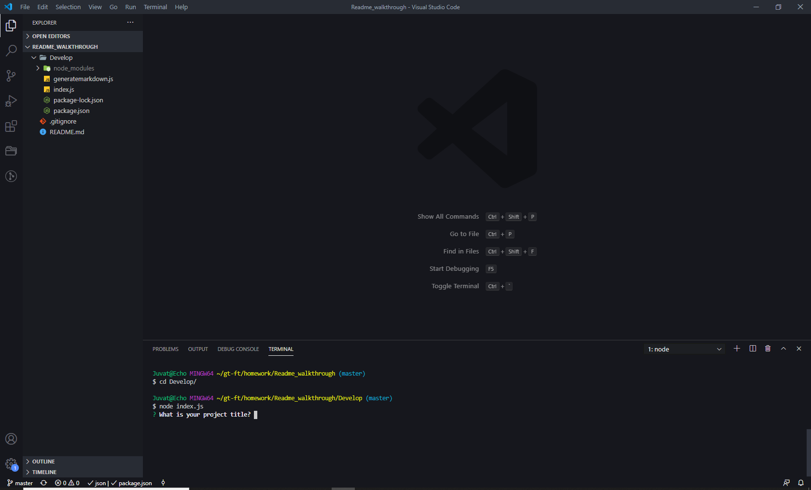
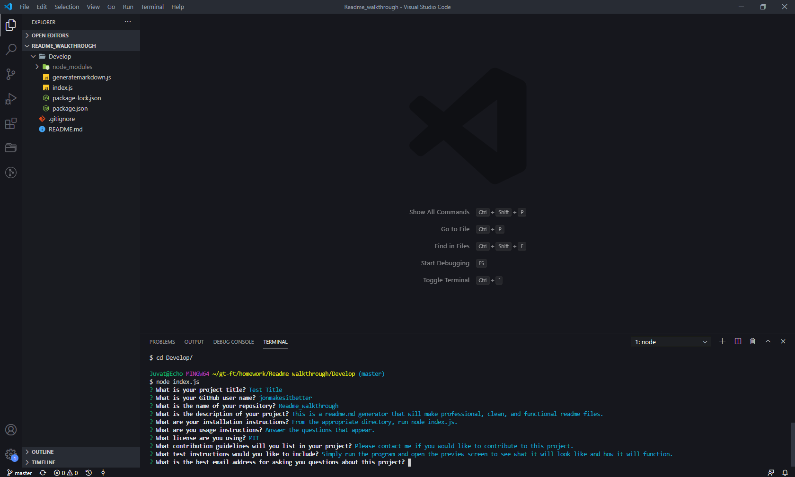
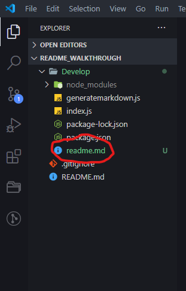
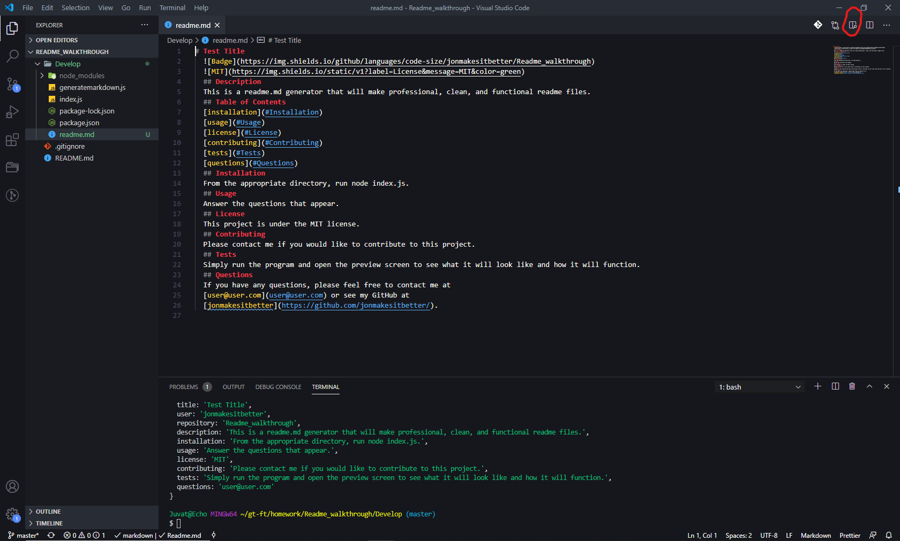
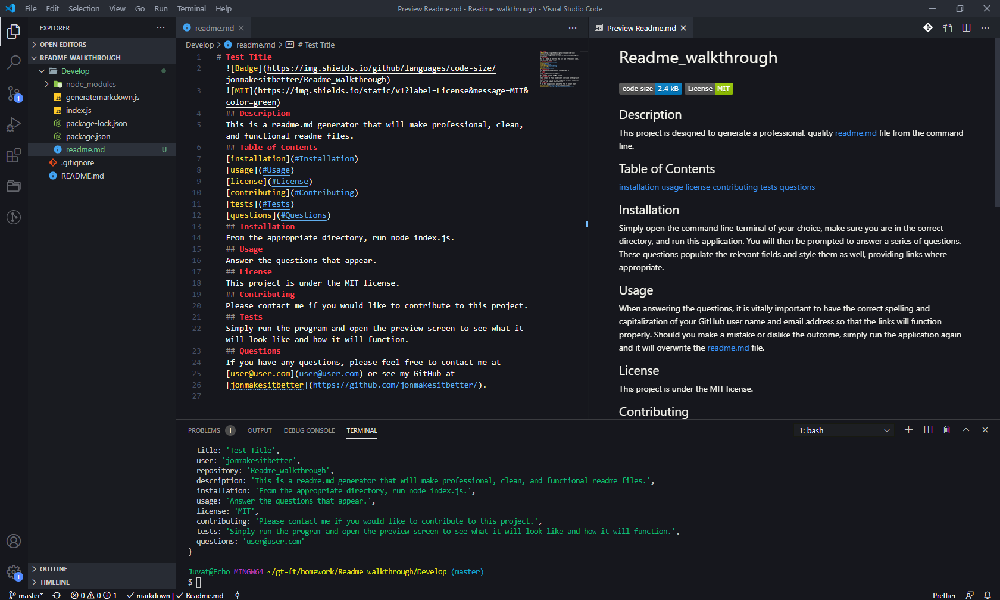

# Test Title
  
  
  ## Description
  This is a readme.md generator that will make professional, clean, and functional readme files.
  ## Table of Contents
  [installation](#Installation)
  [usage](#Usage)
  [license](#License)
  [contributing](#Contributing)
  [tests](#Tests)
  [questions](#Questions)
  ## Installation
  From the appropriate directory, run node index.js.
  
  ## Usage
  Answer the questions that appear.
  
  After answering the questions, a new readme.md file will appear.
  
  Open the new readme.md file and it will appear in your script editor in markdown langauge.
  
  To see what it will look like to the user, select the preview screen icon on the top right of your script editor, shown here.
  
  ## License
  This project is under the MIT license. 
  ## Contributing
  Please contact me if you would like to contribute to this project.
  ## Tests
  Simply run the program and open the preview screen to see what it will look like and how it will function.
  ## Questions
  If you have any questions, please feel free to contact me at
  [user@user.com](user@user.com) or see my GitHub at 
  [jonmakesitbetter](https://github.com/jonmakesitbetter/).
  